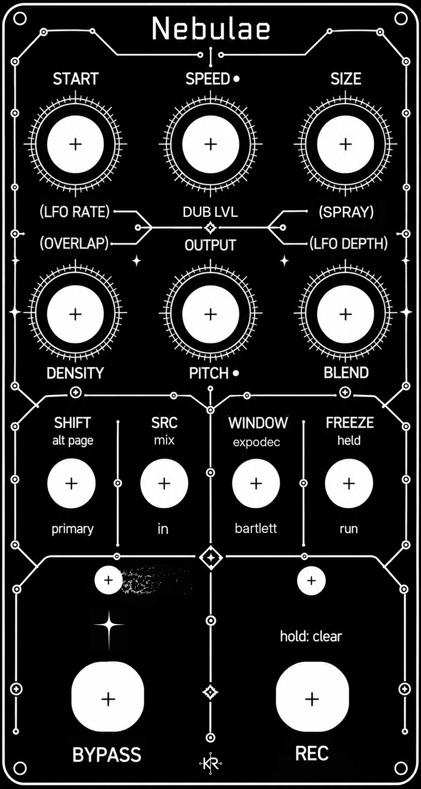
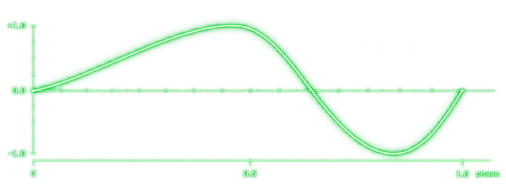

# Nebulae - Granular Looper Pedal

_**A port of the Qu-Bit Nebulae v2 granular looper to a guitar pedal, running on an
Electrosmith Daisy Seed3 in a PedalPCB Terrarium platform**_

Phase vocoder and granular processor running in parallel off a shared 120-second live
buffer, with a blend between them



---

## Credits

| | |
|---|---|
| **Original engine** | Stephen Hensley / Qu-Bit Electronix, `a_granularlooper.instr` (Csound, 2017), [QB_Nebulae_V2](https://github.com/Qu-Bit-Electronix/QB_Nebulae_V2) |
| **Blend rework** | [alex-thibodeau](https://github.com/alex-thibodeau/QB_Nebulae_V2) , a 2-way engine blend with independent dry/wet |
| **Hardware platform** | [PedalPCB Terrarium](https://www.pedalpcb.com/product/terrarium/) |
| **DSP module** | [Electrosmith Daisy Seed3](https://electro-smith.com/) |

This is a **transcription from the original Csound source**, not a reimplementation from
descriptions. Every sound-producing constant (the tanh/cubic density curve, the 0.20 RMS
ceiling, the seven grain windows, the constant-power blend laws, `mincer`'s FFT size and
phase-locking) was taken from the instrument file and validated numerically against a
Python reference before any firmware was written.

**License: MIT.** The upstream Qu-Bit firmware is MIT (Copyright © 2019 Qu-Bit Electronix,
Inc.), so this port carries that forward alongside its own copyright. See [LICENSE](LICENSE).
MIT permits use, modification, distribution and commercial use; the only obligation is to
keep the copyright notice and permission text with the source. libDaisy is likewise MIT.

---

## Architecture

```
                       live input
                           │
                    ┌──────┴──────┐
                    │  DC block   │
                    └──────┬──────┘
                           │
          ┌────────────────┴────────────────┐
          │           record buffer          │   120 s mono float32, A/B double-buffered
          │        (volatile, SDRAM)         │   46.1 MB of 64 MB
          └────────────────┬────────────────┘
                           │
              ┌────────────┴────────────┐
              │        syncphasor        │◄──── LFO 1 (read position)
              │                          │◄──── LFO 2 (loop length)
              └──┬───────────────────┬──┘
                 │                   │
        ┌────────┴──────┐   ┌────────┴─────────┐
        │ mincer        │   │ partikkel        │
        │ phase vocoder │   │ granular         │
        │ FFT 2048      │   │ max 10 grains    │
        │ 4× overlap    │   │ 7 windows        │
        │ phase-locked  │   │ RMS limiter 0.20 │
        └────────┬──────┘   └────────┬─────────┘
                 └─────────┬─────────┘
                     BLEND (constant power)
                           │
                     freq shifter (page 3)
                           │
                    soft limiter ── out
```

---

## Hardware

### Required

| Item | Notes |
|---|---|
| PedalPCB Terrarium (PCB351) Rev 2 | |
| **Daisy Seed3** | 64 MB SDRAM, USB-C. Seed 1 also works |
| 125B enclosure | |
| 6 × B10K 16 mm pots | **POT2 and POT5 must be CENTER DETENT** (Speed and Pitch) |
| 4 × SPDT ON/ON toggle, 6 mm | standard solder-lug pedal toggle, same footprint as every other PedalPCB board |
| 2 × SPST **momentary** footswitch | not 3PDT latching |
| 2 × LED + resistors | |
| 2 × 20-pin female header | |

Passives per the Terrarium build doc. Note C2/C3/C6 are specified **MLCC**, not film. At
1 µF the footprint is 2.5 mm lead pitch, which does not exist in film.

### Pin map (Terrarium Rev 2)

PedalPCB labels the header pins `GPIO n`; libDaisy calls the same pin `D(n−1)`.

| Control | PedalPCB | libDaisy | | Control | PedalPCB | libDaisy |
|---|---|---|---|---|---|---|
| POT1 | GPIO17 | D16 / A1 | | SW1 | GPIO11 | D10 |
| POT2 | GPIO18 | D17 / A2 | | SW2 | GPIO10 | D9 |
| POT3 | GPIO19 | D18 / A3 | | SW3 | GPIO9 | D8 |
| POT4 | GPIO20 | D19 / A4 | | SW4 | GPIO8 | D7 |
| POT5 | GPIO21 | D20 / A5 | | LED1 | GPIO23 | D22 |
| POT6 | GPIO22 | D21 / A6 | | LED2 | GPIO24 | D23 |
| Audio in | pin 16 | AUDIO_IN_L | | FS1 | GPIO26 | D25 |
| Audio out | pin 18 | AUDIO_OUT_L | | FS2 | GPIO27 | D26 |

---

## Controls

### Knobs

| | Primary | SHIFT (SW1 up) |
|---|---|---|
| **POT1** | START, loop start position | LFO RATE |
| **POT2** | SPEED (detent), -4x to +4x, detent = 1x | DUB LVL |
| **POT3** | SIZE, loop length | SPRAY |
| **POT4** | DENSITY, grain rate 0.12 to 983 Hz | OVERLAP |
| **POT5** | PITCH (detent), -3 to +2 oct, detent = unity | OUTPUT |
| **POT6** | BLEND, vocoder / dry / granular | LFO DEPTH |

POT2 and POT5 are centre detent. The detent lands on unity for both.

**SPRAY** is grain position randomisation, ported from the module's Start secondary. At
zero every grain spawns from the playhead, so concurrent grains all read identical audio
and the result is successive stutters rather than a cloud. Turning it up spawns grains
from random positions across the loop. Squared curve, so there is fine control at the
bottom. This is the control that makes it sound granular.

**DUB LVL** scales the input as it is written to the buffer, not what you monitor. Unity
at centre, 0.25x fully CCW, 4x fully CW. It applies to every recording, not just
overdubs. In MIX mode the existing loop arrives via the engine and new material via this
path, so it is the layer balance.

**OUTPUT** is monitoring only and never reaches the recorder, so boosting it does not make
overdubs compound on themselves.

**Shift pots use catch/pickup.** A secondary does not jump to wherever the shared knob
happens to sit. Sweep the knob through the stored value to pick it up. If a parameter
seems dead, sweep it fully counter-clockwise, since several default to 0.0. LFO RATE and
LFO DEPTH both default to 0.0, and at the default rate one cycle takes 50 seconds, so
catch both before deciding whether the LFO works.

### Page 3 (SHIFT up, hold FS1)

Holding **FS1** while SHIFT is up exposes a third page for as long as it is held. There
are no panel labels for these. With SHIFT down, FS1 is a plain bypass tap and nothing
changes.

| | Page 3 | Default |
|---|---|---|
| **POT2** | SIZE LFO RATE | 0.02 Hz, so catch it and bring it up |
| **POT3** | SIZE LFO DEPTH | 0 = off |
| **POT5** | FREQ SHIFT | centre = off |
| POT1, POT4, POT6 | unused | |

Catch mode works across all three pages the same way.

**SIZE LFO** is a plain bipolar sine that multiplies loop length by `2^(depth^2 * lfo)`,
so full depth breathes between half and double length while the playhead rate follows
inversely. Multiplicative so it feels uniform across Size's squared curve. Recording uses
the unmodulated length, so the buffer never breathes.

**FREQ SHIFT** is a Bode-style single-sideband shifter: Hilbert transform through two
4-section allpass chains, then quadrature modulation, one sideband only. That one-sideband
detail is what makes it inharmonic rather than ring mod. Dead zone at centre, then
**exponential 2 Hz to 2 kHz** on each side. Half travel is about 57 Hz, three-quarters
about 330 Hz, which is where sidebands read as timbre. A linear range spent most of the
knob under 100 Hz, which is beating rather than shifting.

```
knob 0.52  ->    +2 Hz   slow beating
knob 0.75  ->   +57 Hz   sidebands start reading as timbre
knob 0.90  ->  +481 Hz   properly metallic
knob 1.00  -> +2000 Hz
```

Image rejection measured at 46 dB. Applied to the pre-gain mix, so overdubs record it.

### Toggles

| | Up | Down |
|---|---|---|
| **SW1 SHIFT** | alt page | primary |
| **SW2 SRC** | **MIX**, records engine output plus input, layers | **IN**, records clean input only, replaces |
| **SW3 WINDOW** | **EXPODEC**, sharp attack with exponential tail | **BARTLETT**, moderately sharp |
| **SW4 FREEZE** | playhead held | run |

Toggle polarity depends on wiring, so up and down may be inverted on your build.

### Footswitches and LEDs

| | |
|---|---|
| **FS1** | Bypass toggle |
| **FS2** | tap = Record on/off, **hold 1 s = Clear buffer** |
| **LED1** | lit = engaged |
| **LED2** | lit = recording, blinks = buffer cleared |

<details>
<summary><b>Controls for the 2.x-ALEXTBLEND branch (click to expand)</b></summary>

<br>

The 2.x branch replaces the stock 3-way blend with a 2-way engine crossfade and moves dry
onto its own control. Under the stock law the vocoder and grains never overlap, since voc
fades out by centre and grain fades in after it. The 2.x law lets both sound together.

| | Primary | SHIFT |
|---|---|---|
| **POT1** | START | LFO RATE |
| **POT2** | SPEED (detent) | DRY/WET |
| **POT3** | SIZE | WINDOW |
| **POT4** | DENSITY | OVERLAP |
| **POT5** | PITCH (detent) | OUTPUT |
| **POT6** | BLEND, vocoder to granular only | LFO DEPTH |

BLEND becomes purely the balance between the two engines. Centre gives 0.707 of each
rather than pure dry. DRY/WET on SHIFT+POT2 is the main output mix and boots fully wet.

This branch has no SPRAY, and its Window is still on a knob. It is less developed than the
1.9.x line and is kept for anyone who prefers that blend behaviour.

</details>

---

## How to use it

### Load your first loop

1. **SW2 to IN**
2. Tap **FS2**, recording starts
3. Play
4. Tap **FS2**, recording stops

In IN mode nothing else affects what is recorded. Loop length is set by where you stop.

### Hear it

5. **BLEND** sets the mix. Fully CCW is the phase vocoder, centre is dry, fully CW is
   granular
6. **SPRAY** (SHIFT+POT3) is what turns stuttering into a grain cloud
7. **DENSITY** and **OVERLAP** shape the texture. Under FREEZE, grain length is the
   stutter length, so Overlap makes it longer and Density retriggers it faster

### Overdub

8. **SW2 to MIX**
9. Tap **FS2** once

Recording **punches in at the current playhead, runs exactly one loop pass, and stops
itself.** You do not tap FS2 again. Loop length is locked, so an overdub cannot shorten
your loop.

The record source is engine output plus your input, independent of BLEND. Use **DUB LVL**
(SHIFT+POT2) to balance the new layer, unity at centre.

### Page 3

With SHIFT up, **hold FS1**. While held, POT2 is size LFO rate, POT3 is size LFO depth
and POT5 is freq shift. Release to return to the shift page.

### Clear

Hold **FS2** for one second. LED2 blinks.

### Considerations

- The buffer is **volatile**. Power down loses it
- Layers are mixed destructively into one buffer. There is no undo and no way to adjust a
  layer after it is recorded
- With SIZE below maximum an overdub covers only that fraction of the loop and stops
  early. That is stock behaviour, since the module ties overdub length to loop size the
  same way
- At unity speed and unity pitch with SPRAY at zero, every concurrent grain reads
  identical audio and differs only in envelope phase. That is why it sounds stuttery
  rather than granular. Raise SPRAY, or move PITCH off its detent

---

## LFO

An addition, not part of the original module. It modulates read position only.

### Shape

A sine with its phase warped before the sine is taken:

```
warp(p) = p / (2s)                    for p < s
          0.5 + (p - s) / (2(1 - s))  for p >= s
out     = sin(2 * pi * warp(p))
```

`s` is the skew, fixed at **0.65**. At `s = 0.5` this reduces to an ordinary sine.

The warp stretches the first 65% of the cycle across the first half of the sine and
compresses the remaining 35% into the second half, so the rise is slow and the fall is
quick. It stays smooth throughout, with no corners or discontinuities.

One cycle sampled in 24 steps, against a pure sine:

```
skew 0.65  +0.20 +0.39 +0.57 +0.72 +0.85 +0.94 +0.99 +1.00 +0.97 +0.90 +0.80 +0.66
           +0.50 +0.32 +0.12 -0.15 -0.50 -0.78 -0.96 -1.00 -0.90 -0.68 -0.37  0.00

sine       +0.26 +0.50 +0.71 +0.87 +0.97 +1.00 +0.97 +0.87 +0.71 +0.50 +0.26 -0.00
           -0.26 -0.50 -0.71 -0.87 -0.97 -1.00 -0.97 -0.87 -0.71 -0.50 -0.26  0.00
```

The rise takes 15 of 24 steps; the fall takes 9.



### How it moves the sound

**It offsets read position, not loop geometry.** Loop start and loop length are computed
before the LFO is applied and are never touched by it, so playback rate and loop boundaries
stay fixed. Only the point being read within the loop moves.

**It is unipolar.** The sine's -1 to +1 range is mapped to 0 to +1, so the offset only ever
pushes forward from the playhead, never behind it. The sweep therefore anchors at the Start
position.

```
uni  = (sin_out + 1) * 0.5          ->  0 to 1
read = phasor + uni * depth^2
```

Depth is squared. At full depth the offset covers an entire loop, so the read position
scans forward through the whole buffer and returns.

**Both engines follow it together**, since they share the read position. The vocoder
time-warps as the read point moves and grains spawn from the moving position. At low depth
this is tape-like wobble; at high depth it becomes a slow scan through the loop.

**Rate is 0.02 to 2 Hz, exponential** (50 seconds per cycle at the slow end).

The asymmetry is what reads as motion rather than oscillation. A symmetric sine feels like
rocking in place; this drifts forward and resets.

### Controls

| | |
|---|---|
| **SHIFT + POT1** | LFO RATE |
| **SHIFT + POT6** | LFO DEPTH (0 = off, output is bit-identical to no LFO) |

---


## Flashing

Firmware is a `.bin`. No toolchain needed.

Enter DFU: **hold BOOT → hold RESET → release RESET → release BOOT.**

### Daisy Web Programmer

1. USB-C to the Seed (a **data** cable, since charge-only cables will not enumerate)
2. Enter DFU
3. Chrome or Edge → https://electro-smith.github.io/Programmer/ *(WebUSB; Firefox and
   Safari will not work)*
4. **Connect** → select **"DFU in FS Mode"** in the dialog → Connect
5. **File Upload** tab → choose the `.bin` → **Program**
6. Tap **RESET**

The onboard Seed LED should blink about once per second. That confirms clocks, SDRAM and
codec all came up.

### Windows: WinUSB driver via Zadig

Required before the web programmer will see the device.

1. Put the Seed in DFU **first**
2. Run [Zadig](https://zadig.akeo.ie/) → Options → **List All Devices**
3. Select **"DFU in FS Mode"** and confirm USB ID reads **0483:DF11**
4. Target driver **WinUSB** → **Install/Replace Driver**
5. Unplug, replug, re-enter DFU

> Zadig must target the DFU entry. Replacing the driver on the running-firmware entry breaks
> a working setup.

### STM32CubeProgrammer (most reliable)

ST's own tool. Talks to the bootloader directly, so no WebUSB, no browser permissions.

1. Enter DFU, USB connected
2. Top-right dropdown → **USB** → Refresh. `USB1` with 0483:DF11 should appear
3. **Connect**
4. Download panel → browse to the `.bin`
5. Start address **`0x08000000`**
6. **Start Programming**
7. **Disconnect** (leave USB plugged in) → tap **RESET**

CubeProgrammer installs its own DFU driver and may supersede the WinUSB binding. If the web
programmer stops working afterwards, that is why. Just keep using CubeProgrammer.

---

## Versions

**Current: `nebulae_v1.10.bin`**

| Version | Change |
|---|---|
| **1.10** | **Current.** Third page on SHIFT + FS1 held. Size LFO (rate on POT2, depth on POT3) and a Bode-style freq shifter with exponential 2 Hz to 2 kHz range on POT5. Catch generalised to three pages |
| 1.9.7 | OUTPUT level no longer reaches the recorder. With output boosted, every overdub had been writing the loop back louder and compounding |
| 1.9.6 | DUB LVL boots at unity. The init value still meant unity on the old input-level curve but -12 dB on the new one, so every recording went in 12 dB down |
| 1.9.5 | Record source is engine output plus input, independent of BLEND. At either Blend extreme the dry factor is zero, so overdubs had captured engine output only and new playing never reached the buffer |
| 1.9.4 | SPRAY on SHIFT+POT3, ported from the Csound. Window moved onto the SW3 toggle |
| 1.9.3 | Record fixed. The overdub latch check ran before the engine had acted on a fresh tap, so it cleared the latch on the block that set it and recording could never start |
| 1.9.2 | Broken, removed. Superseded by 1.9.3 |
| 1.9.1 | Punch-in overdub. Also fixed a v1.9 bug where booting with SHIFT up made the shift page adopt knob positions outright |
| **1.9** | Catch resumes without a re-catch only if the parameter was live when leaving the page |
| 1.8 | RMS limiter moved to control rate. Fixed the grain crackle at high Overlap |
| 1.7 | Skip the engine whose blend coefficient is exactly zero |
| 1.6 | Output level on SHIFT+POT5 |
| 1.5 | Unipolar LFO depth, 0 to +1.0 loop. Catch tolerance widened from 0.2% to 2% |
| 1.1 to 1.4 | Catch adopt, expodec floor, LFO curve, density taper. All reverted |
| **1.0** | **Audio block size 64 to 512.** The critical fix, see below |
| 0.1 to 0.9 | Bring-up: clear, LFO, heartbeat, input level, pot smoothing, FTZ, DC block, soft limit |

**Two branches.** The `1.9.x` line is the maintained one. `2.x-ALEXTBLEND` keeps the
2-way engine blend with dry on its own knob, but has no SPRAY and a less developed looper.

## Deviations from stock

| | |
|---|---|
| **Mono** | Terrarium is single in / single out. Loses grain stereo spread |
| **120 s buffer** | vs 5 min. Volatile, with no file, USB, SD or sample loading anywhere |
| **Secondaries dropped** | All `_alt` params fixed at 0, which *is* stock-at-defaults |
| **Speed/Pitch remap** | Centre detent lands on unity. Endpoints preserved exactly. The module uses encoders, we use pots |
| **SPRAY, DUB LVL, OUTPUT** | SPRAY is the module's Start secondary, restored. DUB LVL and OUTPUT are additions, since the Terrarium is unity gain throughout |
| **Overdub ignores BLEND** | Stock scales the recorded dry by the blend dry factor, which is zero at both extremes. Correct for the module, wrong for a looper |
| **Catch mode** | One pot serving two parameters requires it |
| **Expodec window** | Replaces the stock linear ramp-down, on a toggle so it can be A/B'd |
| **LFO 1** | Not stock. Modulates read position only, so loop geometry is untouched |
| **LFO 2, freq shift** | Not stock. Page 3 additions. Freq shift uses the Hilbert core from kuttor's SuperNova firmware with a re-mapped range |
| **Input/output level** | Terrarium is unity gain; a guitar sits ~20 dB below where the grain RMS limiter engages |
| **DC block, output soft limit, block size 512** | Platform necessities |

Freeze and Reset are not on footswitches: Freeze is literally `kspeed = 0` in the original,
so a toggle does it, and Reset only mattered for CV sync.

---

## Notes from the port

**Block size was the one serious bug.** `mincer` computes an entire frame (two forward
FFTs, one inverse, two 1025-bin loops, and a 2048-sample interpolated SDRAM read) inside a
single audio callback. At 64 samples that's 1.33 ms of budget against ~1.4 ms of work, so
one block in eight overran: a dropout 94×/second that sounded like digital garble. Nebulae
itself runs Csound on a Pi with a ~42 ms output buffer, so its frame work is invisible.

**Sample-exact diffing is the wrong test for a phase vocoder.** `div = 1/(hypot(prev)+1e-20)`
reaches ~1e20 at empty bins, so float rounding compounds through the feedback path. Frame 0
matches the reference to 7.4e-08; after that the waveforms diverge while remaining
spectrally identical to −58 dB. Acceptance criteria are frame-0 agreement, unity gain, exact
pitch ratios and magnitude spectrum. The granular side, being non-recursive, is held to
sample-exact and passes at 2e-07.

**`giHamming` is not Hamming.** The instrument declares `ftgen 20, 9, 1` and comments it
"Hamming Window". GEN20 type 9 is **Sinc**. This matters: sinc reaches exactly 0 at both
endpoints, a real Hamming bottoms at 0.08 and would click at every grain boundary.

**The grain RMS stage is a limiter, not a leveler.** Identity below 0.20, attenuation above.
It never boosts, which is why input level matters on a guitar-level platform.

**Density never reaches its stated 2500 Hz.** The hybrid tanh/cubic scalar tops out at
0.906, so the real maximum is ~983 Hz.

---

## Building from source

```bash
git clone --recursive https://github.com/electro-smith/libDaisy.git
cd libDaisy && make -j
cd .. && mkdir nebulae && cd nebulae
# copy in: main.cpp terrarium.h nebulae_dsp.{h,cpp} nebulae_engine.{h,cpp} Makefile
make          # -> build/nebulae.bin
```

```make
TARGET = nebulae
CPP_SOURCES = main.cpp nebulae_dsp.cpp nebulae_engine.cpp
LIBDAISY_DIR = ../libDaisy
SYSTEM_FILES_DIR = $(LIBDAISY_DIR)/core
include $(SYSTEM_FILES_DIR)/Makefile
```

On Windows, Electrosmith's Daisy Toolchain installer bundles `arm-none-eabi-gcc`, `make` and
`dfu-util`.

---

## License

MIT. See [LICENSE](LICENSE).

- Original engine © 2019 Qu-Bit Electronix, Inc. (MIT)
- Blend rework derived from alex-thibodeau's fork (inherits MIT)
- This port © 2026 Kenny Rakentine (MIT)
- libDaisy © Electrosmith (MIT)

If you fork this, keep all four attributions.

---

## Build 2 plans

Second build once the Terrarium PCB is back in stock. Same firmware, different indication.

| | |
|---|---|
| **LED1** | blue, engaged |
| **LED2** | 3 mm red/green bi-colour, common cathode. Red = recording, green = playback, blinks = cleared. Amber or white = SHIFT page, with recording overriding it |
| **Page 3 button** | Illuminated SPST momentary tact switch (red/green) on a small perfboard behind the panel. Replaces the FS1 hold for page 3, so FS1 goes back to pure bypass. LED lights while held |
| **Input boost** | Optional. Non-inverting op-amp stage (OPA2134) between the input jack and the Terrarium IN pad, gain 4 to 6x. The audio rail is +5 V with VREF at 2.5 V, so usable swing is about 3.5 Vpp and more gain clips the input buffer |

The bi-colour LED's second anode and the button's three lines (switch, red, green) flywire
to free Seed pins (D0 to D6, D11 to D14, D24, D27 to D30) via the underside of the
Terrarium's female header, so the Seed stays removable. Do this before the board goes in
the enclosure.

---

## Known limitations

- **Noise floor.** The Terrarium's analog path is unity gain, so a guitar hits the ADC
  20–30 dB below full scale. Input and output level are applied *after* the converter and
  cannot improve SNR. The real fix is analog gain ahead of the pedal: a clean boost, or a
  preamp stage between the input jack and the Terrarium IN pad. Note the audio rail is +5 V
  with VREF at 2.5 V, so usable swing is ~3.5 Vpp and gain above roughly 4–6× clips the
  input buffer
- **No stereo.** Seed pins 17/19 are unused; a second output buffer would give dual mono.
  True stereo needs a second vocoder and grain cloud. CPU is fine, memory is the limit
- **Bypass is buffered, not true bypass.** Audio always passes through the codec. Loss of
  power means loss of signal
- **~43 ms vocoder latency** against the dry path. Inherent to a 2048-point FFT, and stock
  behaviour
- The module locks Speed/Start/Size during recording and snaps Speed/Pitch to unity after an
  overdub. Neither is implemented, and the second is impossible with pots
